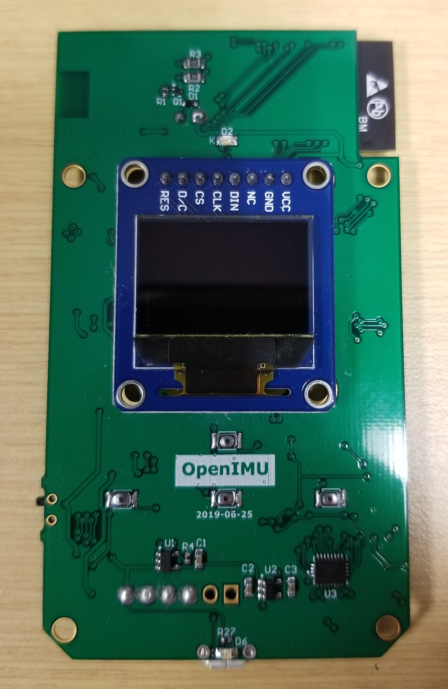
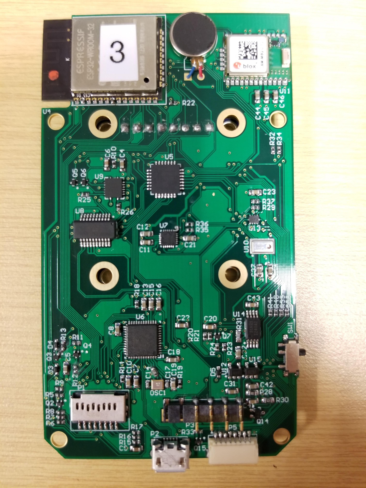
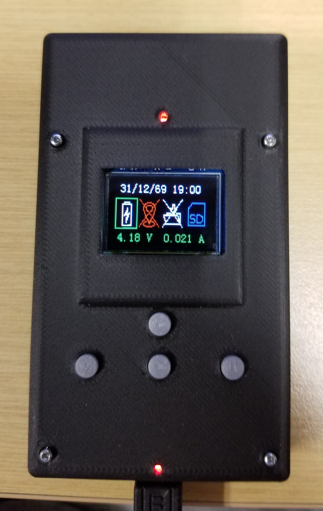
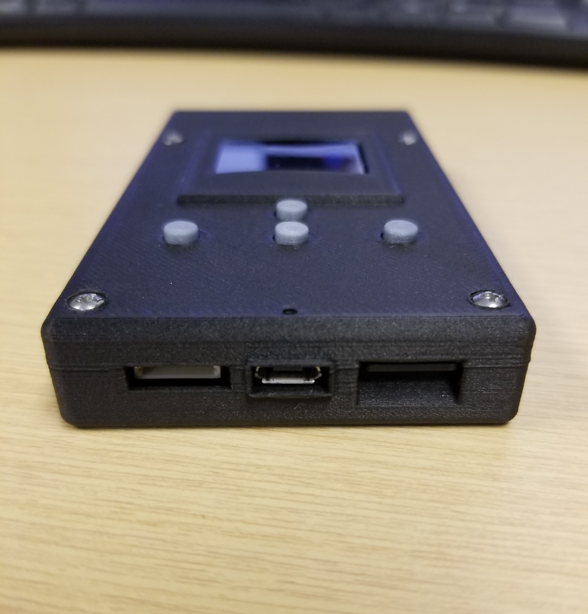
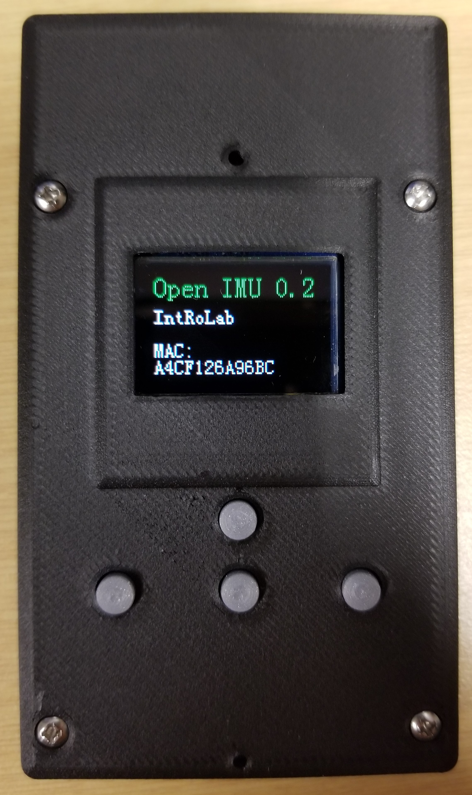
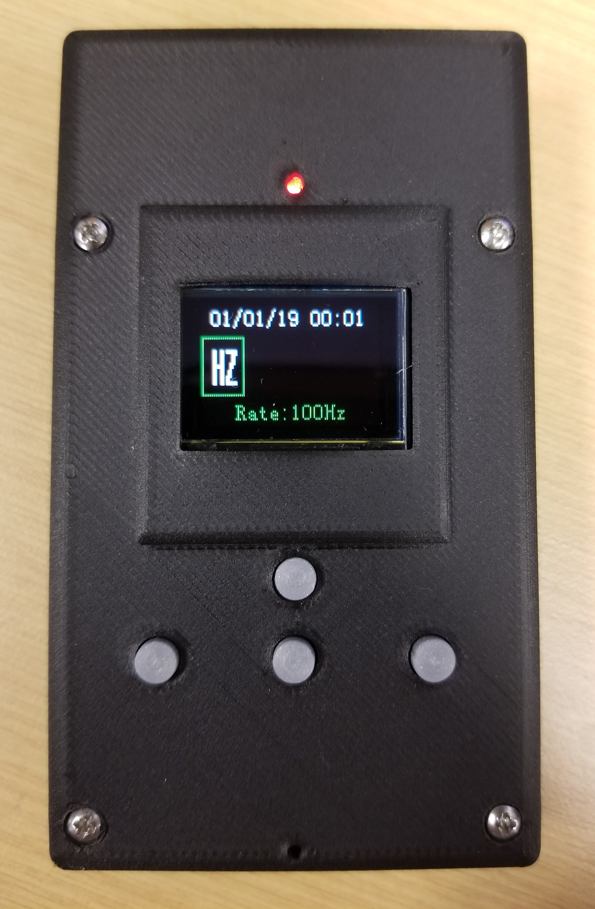

# OpenIMU-MiniLogger
OpenIMU - Open Hardware Mini Logger based on ESP32. 

Please see also :
[OpenIMU](https://github.com/introlab/OpenIMU) Compatible Sofware.

# Authors
* Dominic Létourneau
* Vincent-Philippe Rhéaume
* Cédric Godin
* Philippe-Olivier Provost
* François Michaud
* Simon Brière
* Mathieu Hamel
* Thomas Godel
* Philippe Boulet

# Pictures
## PCB

  

## Case and ports

  

## Starting Menu and Configuration Menu

  

# Features
* [ESP-WROOM-32](https://www.espressif.com/en/esp-wroom-32/resources) based with :
  * [ESP 32 Overview](https://www.espressif.com/en/products/hardware/esp32/overview)
  * WiFi
  * Bluetooth
  * High speed uSD Card Interface (for data logging)
  * High speed USB Mass Storage Interface
  * USB Battery Charger
  * High capacity battery using [Motorala BF5X 1500mA](https://www.battdepot.com/ca/model/cell+phone+battery/motorola/mb525/cmo206.aspx) form factor.
  * Voltage and Current Monitor
  * [9 axis MPU9250 IMU](https://www.invensense.com/products/motion-tracking/9-axis/mpu-9250/)
  * [uBlox CAM-M8Q GPS](https://www.u-blox.com/en/product/cam-m8-series)
  * [NXP / FreeScale MPL115A2 Barometer](https://www.nxp.com/docs/en/data-sheet/MPL115A2.pdf)
  * [WaveShare 0.95" RGB OLED Display](https://www.waveshare.com/wiki/0.95inch_RGB_OLED_(B))
  * [JST JUMPER 08SR-3S](https://www.digikey.ca/product-detail/en/A08SR08SR30K305B/455-3020-ND/6009396/?itemSeq=309204146) connection. with configurable CAN, UART, I2C, Digital I/O.

# Firmware
* Using [PlatformIO](https://platformio.org/)
  * [Arduino](https://github.com/espressif/arduino-esp32) Style (Running in a FreeRTOS Task)
  * Additional use of [FreeRTOS](https://www.freertos.org/) Tasks 

# Schematics & Fab Files
* [Click on this link for AltiumPCB files](./Hardware/AltiumPCB)
* [Schematics](./Hardware/AltiumPCB/Project%20Outputs%20for%20OpenIMU/2018-06-04/OpenIMU.PDF)

# Case & Mechanical Drawings
* [Click on this link for Solidworks and STL files](./Hardware/Solidworks)

## 3D Printing
* [Top Cover STL x1](./Hardware/Solidworks/Top%20Cover.STL)
* [Back Cover STL x1](./Hardware/Solidworks/Back%20Cover%20R2.STL)
* [Button STL x4](./Hardware/Solidworks/Bouton%20Open%20MU.STL)
* [Battery Spacer STL x1](./Hardware/Solidworks/Standoff%20Batterie.STL)

# Building The Project
* Please follow the procedure [here](https://github.com/introlab/OpenIMU-MiniLogger/wiki/Development-Tools).

* [Click on this link to learn how to use the OpenIMU-MiniLogger](./Firmware-IDF/README.md)

# See Also
* [OpenIMU - Open Source Analysis Software](https://github.com/introlab/OpenIMU)
* [OpenWIMU - Activity Tracker Hardware and Software Platform](https://github.com/introlab/openwimu)
